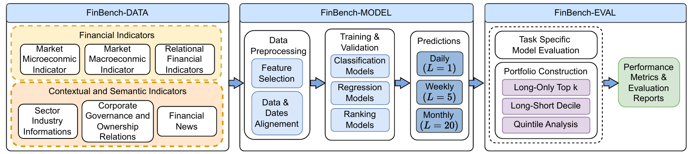

# FinBench

FinBench is a collection of tools, datasets and example implementations to evaluate and experiment with models and algorithms in the financial domain (time-series forecasting, ranking, portfolio simulation, factor modeling, etc.). The repository aims to provide a reproducible foundation for research, benchmarking and rapid prototyping in quantitative finance and financial machine learning.



## Key features

- Structured datasets and data loaders for common financial tasks.
- Preprocessing and feature engineering utilities (technical indicators, rolling statistics, factor calculation).
- Baseline model implementations across multiple tasks (classification, regression, ranking, portfolio optimization).
- Evaluation and backtesting tools for reproducible experiment comparison.
- Per-model example training scripts and requirements to reproduce results.

## Repository layout (high level)

- `Classification/` — Multiple classification model implementations and training scripts (e.g., Adv-ALSTM, CNNPred, DGDNN, HGTAN, MAN-SF, THGNN).
- `Ranking/` — Ranking models and related training pipelines.
- `Regression/` — Regression and forecasting models (FinFormer, FactorVAE, HIST and more).
- `Evaluation/` — Evaluation and backtesting utilities, evaluation scripts and configuration templates.

Note: Each model implementation includes their own `requirements.txt` and example training scripts.

## Quick start

1. Clone the repository:

```
git clone https://github.com/softlab-unimore/finbench.git
cd finbench
```

2. Create and activate a Python virtual environment for each model and Evaluation package.


3. Install dependencies.

   - Global evaluation tools (used by `Evaluation/`):

   ```
   pip install -r Evaluation/requirements.txt
   ```

   - Per-model dependencies: each model folder (for example `Classification/Adv-ALSTM/`) contains a `requirements.txt` with the packages needed for training and evaluation of that model. Follow the instructions in each model folder.


## Running evaluation and examples

1. **Data loading**: `Evaluation/main.py` provide the script to extract data from the data sources and prepare it for training and evaluation. 
  Please run from the root directory:
      ```
      python3 Evaluation/main.py 
      ```
    
2. **Model training**: all the models provide a `train.py` (or `train_2D.py` / `train_3D.py`) script inside their folder. Typical usage (adjust per-model arguments):
    ```
    cd <Model_Folder>
    python3 train.py [<pararms>] 
    ```
    Replace `<Model_Folder>` with the appropriate value. Check the model folder for specific training instructions and required arguments.


3. **Extract task level metrics**: Use the provided tool to collect best validation runs and produce per-model CSV metric summaries.

   1. Verify your results layout
      - Results must follow the pattern:
        ```<Type>/<Model>/results/<Universe>/<Config>/<Seed>/<Year>/*```
   
   2. Run the extractor
      - From the repository root, run:
        ```
        python extract_model_metrics.py --type <TYPE> --model <MODEL_NAME> 
        ```
        Replace `TYPE` and `MODEL_NAME` with the appropriate type and model folder. 
     
        `TYPE` must be one of: `Ranking`, `Classification`, `Regression`.

      - The script will create:
        - `<Type>/<Model>/best_results.json` — best test metrics selected by validation score.
        - `<Type>/<Model>/metrics.csv` — tab-separated table of metrics per (Year, Seed, Universe) for common sl/pl configurations.
   


5. **Evaluation**: `Evaluation/evaluation.py` provide mechanisms compute portfolio metrics on model predictions. 
      ```
      python3 Evaluation/evaluation.py --type <TYPE> --model <MODEL_NAME> 
      ```
   Replace `TYPE` and `MODEL_NAME` with the appropriate values.


Check the docs or the training script in the model folder for model-specific flags and data requirements. 


Almost all models were tested with **Python 3.10**; however, some exceptions (e.g., Adv-ASLTM) required different Python versions due to library compatibility issues.
Check the ```README.md``` in each model folder for specific Python version requirements and installation instructions.


## License

This repository includes a `LICENSE` file at the project root. Review it for terms and conditions before using the code in production.

