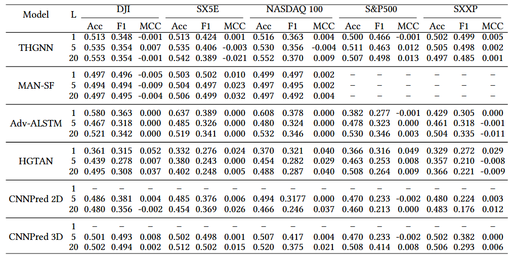
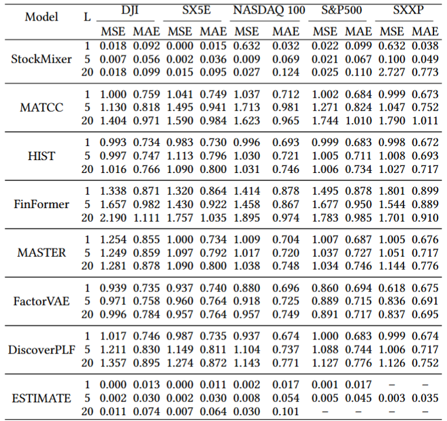
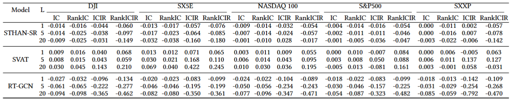
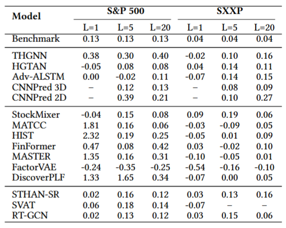
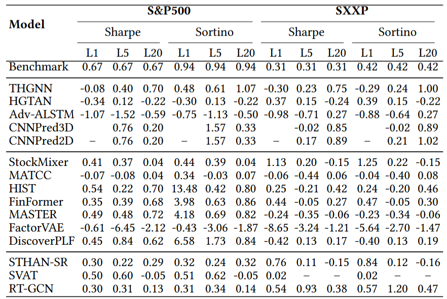

## FinBench Results

**Table 1.** Classification performance under the considered investment universes and prediction horizons (L). Results are shown for a subset of classification models from the benchmark and reported in terms of Accuracy (Acc), F1-score (F1), and Matthews Correlation Coefficient (MCC) for multiple forecast lengths L.

  

**Table 2.** Regression performance under multiple prediction horizons (L), reported in terms of MSE and MAE. Results are shown for a subset of regression models from the benchmark. Models are grouped by the target normalization strategy adopted in their original implementations.

  

**Table 3.** Ranking performance for multiple prediction horizons (𝐿) reported in terms of IC, Rank IC, ICIR, and Rank ICIR.

  

**Table 4.**Long-only Top-10 portfolio performance (CAGR%) across S&P 500 and SXXP investment universes and prediction horizons (𝐿). The first row reports the market benchmark; subsequent rows report model-based portfolio metrics.

  

**Table 5.** Long–Short Top-10 portfolio performance across S&P 500 and SXXP investment universes and prediction horizons (𝐿), reported in terms of Sharpe and Sortino ratios. The first
row reports the market benchmark; subsequent rows report model-based Long–Short portfolio metrics.

  

